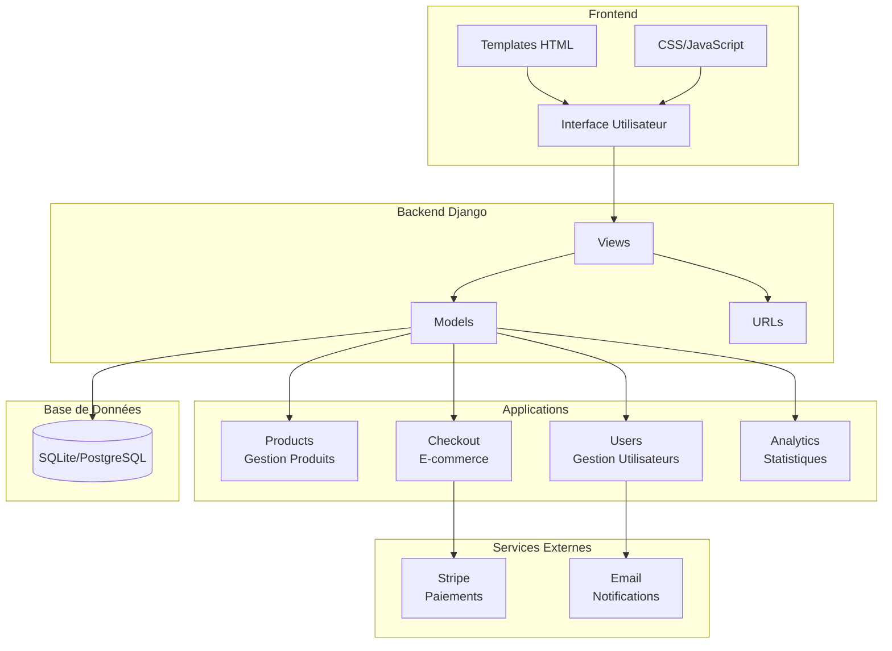
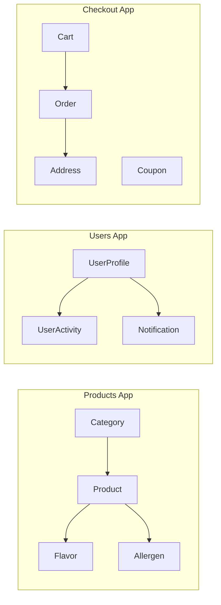
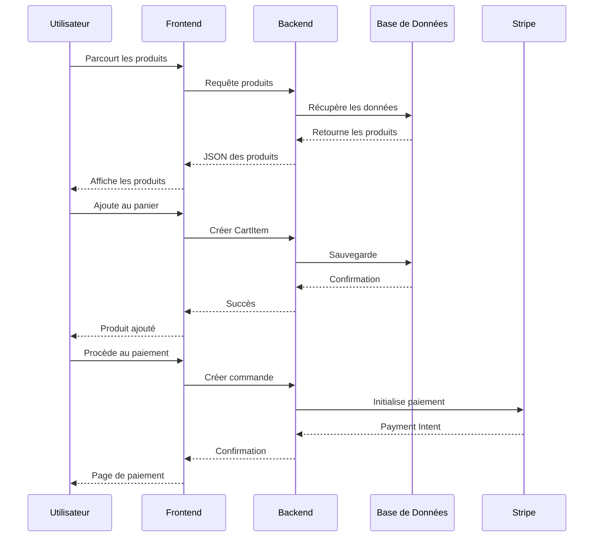

# Architecture du Système - La Caravela

## Vue d'ensemble

Système de gestion e-commerce pour glaces artisanales développé en Django.

## Diagramme d'Architecture Simplifié

## Structure des Modules

## Flux de Données

## Technologies Utilisées

- **Backend**: Django 4.x, Python 3.x
- **Base de données**: SQLite (dev) / PostgreSQL (prod)
- **Frontend**: HTML5, CSS3, JavaScript, Bootstrap
- **Paiements**: Stripe API
- **Déploiement**: Docker, Docker Compose
- **CI/CD**: GitHub Actions

## Fonctionnalités Implémentées

### 🍦 Gestion des Produits
- Catégories et sous-catégories
- Gestion des parfums et allergènes
- Images multiples par produit
- Système de prix dynamique
- Gestion des stocks

### 👤 Gestion des Utilisateurs
- Profils utilisateur étendus
- Programme de fidélité
- Préférences personnalisées
- Historique des commandes

### 🛒 E-commerce
- Panier persistant
- Processus de commande complet
- Intégration Stripe
- Gestion des adresses
- Codes promo et remises

### 📊 Analytics
- Suivi des activités utilisateur
- Statistiques de vente
- Rapports de performance
