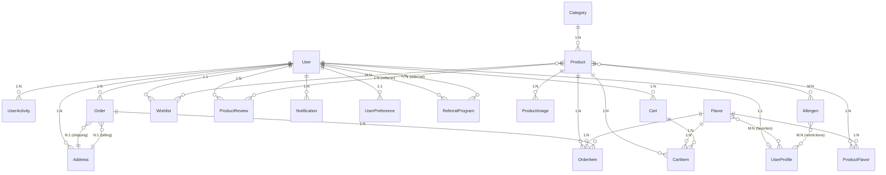

# Diagramme de Classes - La Caravela

## Vue d'ensemble du système

Ce diagramme présente l'architecture complète du système de gestion de glaces artisanales "La Caravela" avec toutes les relations entre les modèles.

## Diagramme de Classes Principal

```mermaid
classDiagram
    %% Modèles de base Django
    class User {
        +id: int
        +username: str
        +email: str
        +first_name: str
        +last_name: str
        +is_active: bool
        +is_staff: bool
        +is_superuser: bool
        +date_joined: datetime
        +last_login: datetime
    }

    %% Modèles Produits
    class Category {
        +id: int
        +name: str
        +slug: str
        +description: text
        +image: ImageField
        +is_active: bool
        +order: int
        +created_at: datetime
        +updated_at: datetime
        +get_absolute_url()
        +save()
    }

    class Product {
        +id: int
        +name: str
        +slug: str
        +description: text
        +short_description: str
        +image: ImageField
        +category: ForeignKey
        +product_type: str
        +base_price: Decimal
        +sale_price: Decimal
        +is_customizable: bool
        +is_featured: bool
        +is_active: bool
        +stock_quantity: int
        +min_order_quantity: int
        +max_order_quantity: int
        +created_at: datetime
        +updated_at: datetime
        +get_absolute_url()
        +current_price()
        +is_on_sale()
        +discount_percentage()
    }

    class Allergen {
        +id: int
        +name: str
        +icon: str
        +description: text
        +is_active: bool
    }

    class Flavor {
        +id: int
        +name: str
        +slug: str
        +description: text
        +color: str
        +is_active: bool
        +order: int
        +save()
    }

    class ProductFlavor {
        +id: int
        +product: ForeignKey
        +flavor: ForeignKey
        +price_modifier: Decimal
        +is_available: bool
        +order: int
    }

    class ProductImage {
        +id: int
        +product: ForeignKey
        +image: ImageField
        +alt_text: str
        +is_primary: bool
        +order: int
        +created_at: datetime
    }

    class CustomizationOption {
        +id: int
        +name: str
        +slug: str
        +option_type: str
        +description: text
        +price: Decimal
        +image: ImageField
        +is_active: bool
        +max_selections: int
        +order: int
        +save()
    }

    class ProductReview {
        +id: int
        +product: ForeignKey
        +user: ForeignKey
        +rating: int
        +title: str
        +comment: text
        +is_approved: bool
        +created_at: datetime
        +updated_at: datetime
    }

    class Wishlist {
        +id: int
        +user: ForeignKey
        +products: ManyToManyField
        +created_at: datetime
        +updated_at: datetime
    }

    %% Modèles Utilisateurs
    class UserProfile {
        +id: int
        +user: OneToOneField
        +phone: str
        +birth_date: date
        +gender: str
        +favorite_flavors: ManyToManyField
        +dietary_restrictions: ManyToManyField
        +newsletter_subscription: bool
        +loyalty_points: int
        +loyalty_tier: str
        +total_orders: int
        +total_spent: Decimal
        +last_order_date: datetime
        +created_at: datetime
        +updated_at: datetime
        +age()
        +add_loyalty_points()
        +update_loyalty_tier()
        +get_loyalty_discount()
    }

    class UserActivity {
        +id: int
        +user: ForeignKey
        +activity_type: str
        +description: str
        +metadata: JSONField
        +ip_address: str
        +user_agent: text
        +created_at: datetime
    }

    class ReferralProgram {
        +id: int
        +referrer: ForeignKey
        +referred: ForeignKey
        +referral_code: str
        +is_active: bool
        +reward_claimed: bool
        +created_at: datetime
    }

    class Notification {
        +id: int
        +user: ForeignKey
        +notification_type: str
        +title: str
        +message: text
        +is_read: bool
        +is_sent: bool
        +metadata: JSONField
        +created_at: datetime
        +read_at: datetime
        +mark_as_read()
    }

    class UserPreference {
        +id: int
        +user: OneToOneField
        +email_notifications: bool
        +sms_notifications: bool
        +push_notifications: bool
        +preferred_shipping_method: str
        +save_payment_info: bool
        +default_ice_cream_size: str
        +created_at: datetime
        +updated_at: datetime
    }

    %% Modèles Checkout
    class Address {
        +id: int
        +user: ForeignKey
        +address_type: str
        +is_default: bool
        +first_name: str
        +last_name: str
        +company: str
        +address_line_1: str
        +address_line_2: str
        +city: str
        +state: str
        +postal_code: str
        +country: str
        +phone: str
        +created_at: datetime
        +updated_at: datetime
        +save()
    }

    class Cart {
        +id: int
        +user: ForeignKey
        +session_key: str
        +created_at: datetime
        +updated_at: datetime
        +total_items()
        +subtotal()
        +total()
        +shipping_cost()
        +discount_amount()
    }

    class CartItem {
        +id: int
        +cart: ForeignKey
        +product: ForeignKey
        +flavor: ForeignKey
        +quantity: int
        +customizations: JSONField
        +created_at: datetime
        +updated_at: datetime
        +unit_price()
        +total_price()
    }

    class Order {
        +id: int
        +order_number: str
        +user: ForeignKey
        +order_status: str
        +payment_status: str
        +shipping_address: ForeignKey
        +billing_address: ForeignKey
        +subtotal: Decimal
        +shipping_cost: Decimal
        +discount_amount: Decimal
        +total: Decimal
        +payment_method: str
        +stripe_payment_intent_id: str
        +shipping_method: str
        +tracking_number: str
        +estimated_delivery: date
        +notes: text
        +created_at: datetime
        +updated_at: datetime
        +save()
        +is_paid()
        +can_be_cancelled()
    }

    class OrderItem {
        +id: int
        +order: ForeignKey
        +product: ForeignKey
        +flavor: ForeignKey
        +quantity: int
        +unit_price: Decimal
        +total_price: Decimal
        +customizations: JSONField
    }

    class Coupon {
        +id: int
        +code: str
        +description: str
        +coupon_type: str
        +value: Decimal
        +min_order_amount: Decimal
        +max_uses: int
        +used_count: int
        +valid_from: datetime
        +valid_until: datetime
        +is_active: bool
        +created_at: datetime
        +is_valid()
        +apply_to_order()
    }

    %% Relations principales
    User ||--o{ UserProfile : "a un profil"
    User ||--o{ UserActivity : "a des activités"
    User ||--o{ ReferralProgram : "parraine"
    User ||--o{ ReferralProgram : "est parrainé"
    User ||--o{ Notification : "reçoit"
    User ||--o{ UserPreference : "a des préférences"
    User ||--o{ Address : "a des adresses"
    User ||--o{ Cart : "a un panier"
    User ||--o{ Order : "passe des commandes"
    User ||--o{ Wishlist : "a une liste de souhaits"
    User ||--o{ ProductReview : "écrit des avis"

    Category ||--o{ Product : "contient"
    Product }o--o{ Allergen : "peut contenir"
    Product }o--o{ Flavor : "a des parfums"
    Product ||--o{ ProductFlavor : "détail parfum"
    Flavor ||--o{ ProductFlavor : "détail produit"
    Product ||--o{ ProductImage : "a des images"
    Product ||--o{ ProductReview : "reçoit des avis"
    Product }o--o{ Wishlist : "dans les listes"
    Product ||--o{ CartItem : "dans le panier"
    Product ||--o{ OrderItem : "dans les commandes"

    Cart ||--o{ CartItem : "contient"
    CartItem }o--|| Product : "référence"
    CartItem }o--o| Flavor : "avec parfum"

    Order ||--o{ OrderItem : "contient"
    OrderItem }o--|| Product : "référence"
    OrderItem }o--o| Flavor : "avec parfum"
    Order }o--|| Address : "adresse livraison"
    Order }o--|| Address : "adresse facturation"

    UserProfile }o--o{ Flavor : "parfums préférés"
    UserProfile }o--o{ Allergen : "restrictions"
```

## Diagramme des Relations de Base de Données



## Description des Modules

### 🍦 Module Produits (products)
- **Category** : Gestion des catégories de glaces
- **Product** : Produits principaux avec prix et stock
- **Flavor** : Parfums disponibles
- **Allergen** : Allergènes et restrictions
- **ProductFlavor** : Relation produit-parfum avec prix
- **ProductImage** : Images multiples par produit
- **CustomizationOption** : Options de personnalisation
- **ProductReview** : Système d'avis clients
- **Wishlist** : Listes de souhaits

### 👤 Module Utilisateurs (users)
- **UserProfile** : Profil étendu avec fidélité
- **UserActivity** : Tracking des activités
- **ReferralProgram** : Système de parrainage
- **Notification** : Notifications utilisateur
- **UserPreference** : Préférences personnalisées

### 🛒 Module Checkout (checkout)
- **Address** : Adresses de livraison/facturation
- **Cart** : Panier d'achat
- **CartItem** : Articles du panier
- **Order** : Commandes
- **OrderItem** : Articles de commande
- **Coupon** : Codes promo et remises

## Fonctionnalités Clés

### 🎯 Gestion des Produits
- Catégorisation hiérarchique
- Gestion des parfums et allergènes
- Système de prix dynamique
- Images multiples
- Personnalisation avancée
- Avis et notes clients

### 👥 Gestion des Utilisateurs
- Profils étendus
- Programme de fidélité
- Système de parrainage
- Préférences personnalisées
- Tracking des activités

### 🛍️ E-commerce
- Panier persistant
- Commandes complètes
- Adresses multiples
- Codes promo
- Suivi des commandes

### 📊 Analytics
- Tracking des activités
- Statistiques de vente
- Comportement utilisateur
- Performance des produits

Ce diagramme représente l'architecture complète du système La Caravela avec toutes les relations et fonctionnalités implémentées.
