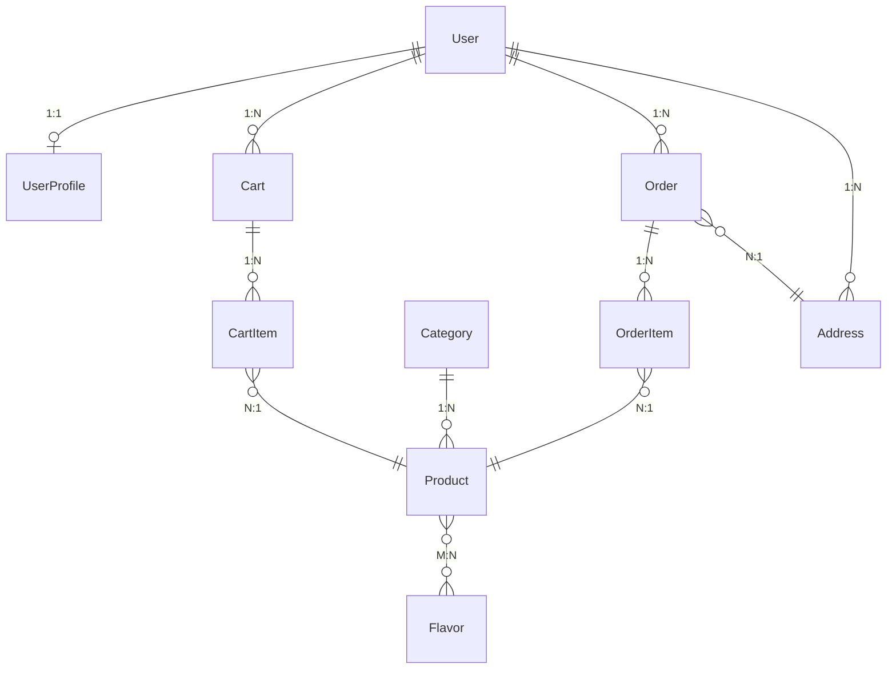

# Diagramme de Classes - La Caravela

## Vue d'ensemble du système

Ce diagramme présente l'architecture du système de gestion de glaces artisanales "La Caravela".

## Diagramme de Classes Principal

```mermaid
classDiagram
    %% Modèles Utilisateurs
    class User {
        +id: int
        +username: str
        +email: str
        +first_name: str
        +last_name: str
    }
    
    class UserProfile {
        +user: OneToOneField
        +phone: str
        +loyalty_points: int
        +total_orders: int
        +add_loyalty_points()
    }

    %% Modèles Produits
    class Category {
        +id: int
        +name: str
        +slug: str
        +description: text
        +image: ImageField
    }

    class Product {
        +id: int
        +name: str
        +slug: str
        +description: text
        +category: ForeignKey
        +base_price: Decimal
        +sale_price: Decimal
        +stock_quantity: int
        +current_price()
    }

    class Flavor {
        +id: int
        +name: str
        +slug: str
        +description: text
        +color: str
    }

    %% Modèles E-commerce
    class Cart {
        +id: int
        +user: ForeignKey
        +session_key: str
        +total_items()
        +subtotal()
    }

    class CartItem {
        +id: int
        +cart: ForeignKey
        +product: ForeignKey
        +flavor: ForeignKey
        +quantity: int
        +unit_price()
    }

    class Order {
        +id: int
        +order_number: str
        +user: ForeignKey
        +order_status: str
        +payment_status: str
        +total: Decimal
        +is_paid()
    }

    class OrderItem {
        +id: int
        +order: ForeignKey
        +product: ForeignKey
        +quantity: int
        +unit_price: Decimal
    }

    class Address {
        +id: int
        +user: ForeignKey
        +address_type: str
        +first_name: str
        +last_name: str
        +city: str
        +country: str
    }

    %% Relations principales
    User ||--o| UserProfile : "profil"
    User ||--o{ Cart : "panier"
    User ||--o{ Order : "commandes"
    User ||--o{ Address : "adresses"

    Category ||--o{ Product : "contient"
    Product }o--o{ Flavor : "parfums"

    Cart ||--o{ CartItem : "articles"
    CartItem }o--|| Product : "produit"
    CartItem }o--o| Flavor : "parfum"

    Order ||--o{ OrderItem : "articles"
    OrderItem }o--|| Product : "produit"
    Order }o--|| Address : "livraison"
    Order }o--|| Address : "facturation"
```

## Diagramme des Relations de Base de Données



## Modules du Système

### 🍦 Module Produits
- **Category** : Catégories de glaces
- **Product** : Produits avec prix et stock
- **Flavor** : Parfums disponibles

### 👤 Module Utilisateurs
- **User** : Utilisateurs Django
- **UserProfile** : Profil étendu avec fidélité

### 🛒 Module E-commerce
- **Cart** : Panier d'achat
- **CartItem** : Articles du panier
- **Order** : Commandes
- **OrderItem** : Articles de commande
- **Address** : Adresses de livraison

## Fonctionnalités Clés

- ✅ Gestion des produits avec catégories et parfums
- ✅ Panier d'achat persistant
- ✅ Système de commandes complet
- ✅ Programme de fidélité
- ✅ Gestion des adresses multiples
- ✅ Interface d'administration Django
